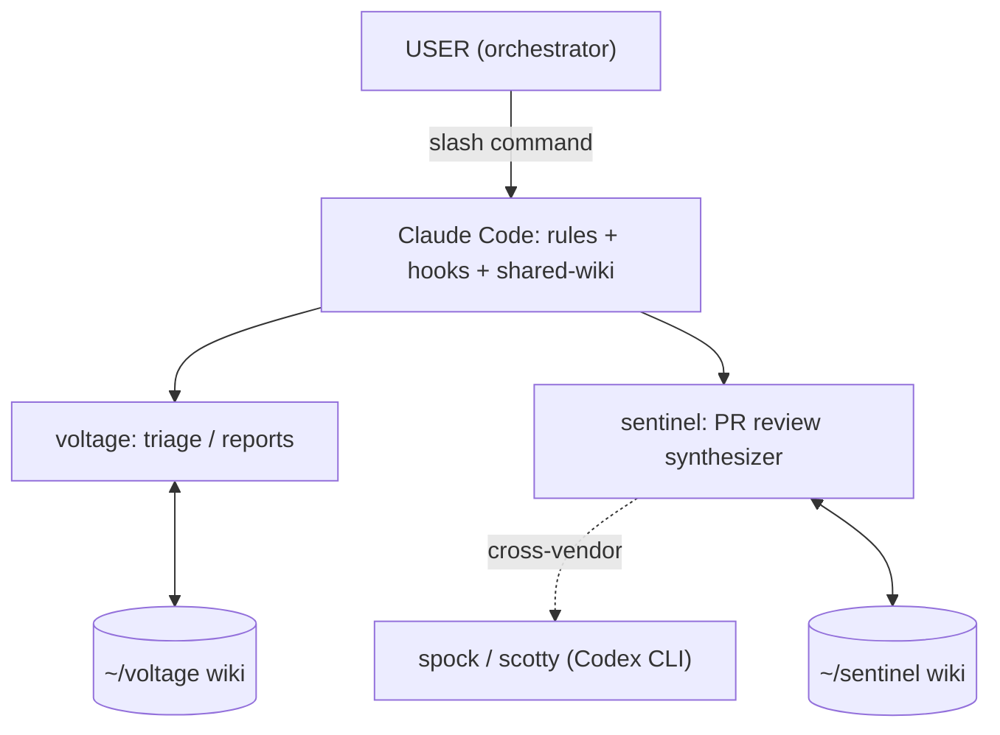

# agentic-fabric

A personal multi-agent stack for Claude Code: communication triage, PR review with institutional memory, cross-vendor verification, automated reporting, and the hooks/rules that keep it honest.

Built and dogfooded daily over months of real DevOps/SRE work. Sanitized for portability — org names, IDs, and internal references are placeholders (`your-org`, `YOUR_SLACK_USER_ID`, `youralias/`, ...); grep for them when adapting.

## What's inside

| Dir | Contents |
|-----|----------|
| `agents/` | Agent definitions. Two families plus build/QA roles: **voltage** (chief-of-staff: multi-channel triage, tiered classification + routing verdicts, draft replies, wiki memory) with fetcher/scribe/reporter subagents; **sentinel** (PR review synthesizer: evidence-calibrated severity, review-cycle convergence bounds, wiki-backed repo/author memory) with fetcher/scribe, **spock** (cross-vendor reviewer via a second model family) and **scotty** (cross-vendor patch drafter). Plus orchestrator, researcher, implementer, tester, debugger, architect(s), senior-qa, context-manager. |
| `agents/voltage-reporter/` | launchd-driven daily/weekly report automation: `run.sh` (21:00 cron), `catchup.sh` (4h backfill), `session-drain-check.sh` (SessionStart hook that delivers queued reports when an interactive session can reach Slack — headless runs can't reach OAuth connectors). |
| `skills/` | Slash-command workflows: `/triage`, `/daily-report`, `/weekly-report`, `/standup`, `/review-pr`, `/draft-pr-fixes`, `/self-review`, `/pr-sizer`, `/workflow-miner`, `/memory-lint`, `/wiki-lint`, `/ci-investigation`, session management, delegation patterns, and more. |
| `commands/` | Older-style command prompts (PR summary, design doc, prompt-writing guide, standup). |
| `scripts/` | PreToolUse hooks: branch-prefix enforcement (`youralias/` gate), PR-create gate, wiki gate-page protection, skill scanner. |
| `rules/` | Global rules files (general, git, planning, prompting, python, typescript, testing). |
| `shared-wiki/` | Cross-agent convention pages: agent principles, search discipline, orchestration patterns (incl. the persona-to-pattern mapping). |
| `wikis/voltage/`, `wikis/sentinel/` | The wiki *machinery* for each agent's persistent memory: purpose, schema, page templates, convention pages, helper scripts. Wiki *data* (people, logs, reviews, reports) deliberately excluded. |
| `launchd/` | macOS LaunchAgent plists for the report automation. |
| `docs/settings.hooks.example.json` | Hook wiring for `~/.claude/settings.json` (commands are placeholders). |

## How it fits together



Full diagrams and control flow: [docs/ARCHITECTURE.md](docs/ARCHITECTURE.md).

## Prerequisites

Required for the core triage + PR-review path:

- **[Claude Code](https://docs.anthropic.com/en/docs/claude-code)** — the whole stack layers on it.
- **[`gh` CLI](https://cli.github.com/)**, authenticated (`gh auth login`) — PR fetch, review, and the PR-create gate.
- **`git`** — branches, wikis, PRs.
- **`grep`** and **`python3`** — used by the branch-prefix hook (`scripts/enforce-branch-prefix.sh` → `.py`).
- **`jq`** — used by the `gh-pr-create-gate.sh` and `protect-gate-pages.sh` hooks.

Optional, per feature:

- **macOS** — only for the launchd daily/weekly report automation (`launchd/`, `agents/voltage-reporter/run.sh` uses BSD `date`).
- **[OpenAI Codex CLI](https://github.com/openai/codex)** — only for the cross-vendor reviewer/patch-drafter (`spock`, `scotty` run `codex exec --sandbox read-only`). Skip if you don't use `/review-pr`'s cross-vendor cascade or `/draft-pr-fixes`.
- **A Slack app / MCP connector** — only for report delivery and Slack triage (`/daily-report`, `/triage`). Read-only Slack search plus a send tool on the main thread.

Not required: no Node/npm, no build step — these are prompts, shell hooks, and markdown.

## Quickstart

Minimal path to a working triage + PR-review setup. Run from the repo root after cloning. Review the prompts and hooks before you run them.

```bash
# 1. Copy the agent stack into your Claude Code config
cp -R agents skills commands scripts rules shared-wiki ~/.claude/
chmod +x ~/.claude/scripts/*.sh ~/.claude/scripts/*.py

# 2. Seed the agent wikis (machinery only; data fills itself through use)
mkdir -p ~/voltage ~/sentinel
cp -R wikis/voltage/. ~/voltage/
cp -R wikis/sentinel/. ~/sentinel/

# 3. Find every placeholder you must replace (see table below)
grep -rn "your-org\|youralias\|YOUR_SLACK\|you@example.com\|/Users/youruser" ~/.claude
```

4. **Replace placeholders** in your `~/.claude` copy (not the repo). See the table below.

5. **Wire the hooks.** Merge `docs/settings.hooks.example.json` into `~/.claude/settings.json`, swapping every `/Users/youruser/...` path for your real home and replacing the `your-pretool-hook` / `your-stop-guard` placeholders with your own commands (or removing those entries if you don't have them).

Restart Claude Code so it picks up the new agents, skills, and hooks. Then run **Verify** below.

Optional add-ons (do after the core path works): [report automation](#optional-report-automation-macos) and [Slack delivery](#optional-report-automation-macos).

## Placeholders

Replace in your `~/.claude` copy before use. The grep in step 3 finds all of them.

| Placeholder | Where | Required? |
|-------------|-------|-----------|
| `/Users/youruser/...` | `settings.hooks.example.json`, `launchd/*.plist` | **Required** — must match your real `$HOME`, or hooks/cron won't resolve. |
| `youralias/` | `scripts/enforce-branch-prefix.py` (`REQUIRED_PREFIX`) | **Required if** you enable the branch-prefix hook — set it to your own branch namespace. |
| `your-org` | rules, wiki machinery, examples | Required if referenced in your workflows; otherwise cosmetic. |
| `you@example.com` | rules, examples | Optional — cosmetic unless a workflow depends on it. |
| `YOUR_SLACK_USER_ID` / `user_slack.md` | Slack triage + report delivery | **Required if** you use Slack (`/triage`, `/daily-report`); otherwise skip. |
| `your-pretool-hook`, `your-stop-guard` | `settings.hooks.example.json` | Optional — your own custom hooks; remove the entries if unused. |

## Verify your install

After restarting Claude Code:

- **Skills load** — open the slash-command menu (`/`) and confirm `/triage`, `/review-pr`, `/self-review` appear. `/help` lists available commands.
- **Agents load** — the agent names in `agents/` (voltage, sentinel, ...) resolve when referenced.
- **Hooks fire** — the branch-prefix gate is the easiest check: ask the agent to create a branch that does *not* start with your alias (e.g. `git checkout -b test-branch`). The hook should block it with a message telling you to use your `<alias>/` prefix. A `<alias>/...` branch should succeed.
- **PR gate** — asking the agent to run `gh pr create` without `--draft` should be denied with a "Review-first PR workflow required" message.

If a hook doesn't fire, re-check the paths in `~/.claude/settings.json` (step 5) and that the scripts are executable (`chmod +x`).

## How to use

Once installed, drive the stack through slash commands:

| Command | When to use |
|---------|-------------|
| `/triage` | Morning multi-channel sweep — classify email/Slack, draft replies (sending stays human-gated). |
| `/review-pr <url>` | Review a PR with the sentinel synthesizer; cascades cross-vendor peers on security/arch paths. |
| `/self-review` | Review your own local branch before opening a PR. |
| `/draft-pr-fixes` | After a review, have the cross-vendor drafter propose patches for cherry-pick (never auto-applied). |
| `/pr-sizer` | Check whether a PR is too large and get a split plan. |
| `/daily-report`, `/weekly-report` | Generate an activity report from GitHub/Slack; delivered via Slack DM. |
| `/standup` | Daily standup summary from commits + GitHub activity. |
| `/ci-investigation` | Investigate failing CI on a PR. |
| `/wiki-lint`, `/memory-lint`, `/workflow-miner` | Maintenance — health-check wikis/memory and mine recurring tasks. |

## Optional: report automation (macOS)

The daily/weekly reports run on a launchd schedule and deliver via Slack.

1. Copy the plists in `launchd/` to `~/Library/LaunchAgents/`, replacing every `/Users/youruser/...` path with your real home.
2. Load them with `launchctl` (macOS LaunchAgents).
3. Reports generate offline and queue; delivery is a separate step handled by the main (interactive) session via the `SessionStart` drain hook, so headless runs never silently drop a report. See `agents/voltage-reporter/`.

Slack delivery needs a Slack app / MCP connector with a send tool available on the main thread, plus your Slack user ID wired per the `YOUR_SLACK_USER_ID` placeholder.

## Design principles

For the internals, the whys, and the decisions behind them, see [`docs/`](docs/) — [architecture](docs/ARCHITECTURE.md), [design principles](docs/DESIGN-PRINCIPLES.md), and the [decision records](docs/decisions/). The short list:

- Judgment on the big model, mechanics on cheap ones (haiku fetchers, sonnet scribes)
- Hooks over prompts for anything that must not be skipped
- Wikis as persistent memory — every session reads from and writes back to them
- Evidence-calibrated review severity: unverified BLOCKER claims get downgraded
- Cross-vendor cascade for reasoning diversity on security-critical paths
- Outbound actions (sends, merges) always human-gated

## Security

These are prompts and hooks that drive an agent with real tool access (shell, `git`, `gh`, Slack, and — if enabled — a second-vendor CLI that sends context to OpenAI servers). Treat them accordingly:

- **Review before you run.** Read the agent definitions, skills, and hook scripts before copying them into `~/.claude/`.
- **Keep outbound actions human-gated.** Message sends and PR merges are gated by design (see the PR-create draft gate and the `[Send]/[Edit]/[Skip]` triage flow); keep them that way.
- **Cross-vendor CLIs run read-only.** `spock`/`scotty` wrap `codex exec --sandbox read-only` and never write files — the orchestrator applies any patch under your permission model.

To report a vulnerability, see [SECURITY.md](SECURITY.md).

## Contributing

See [CONTRIBUTING.md](CONTRIBUTING.md). These are prompts and hooks that drive an agent with tool access — review before you run them, and keep outbound actions human-gated.

## License

[Apache License 2.0](LICENSE). Portions of `shared-wiki/orchestration-patterns.md` are adapted from [addyosmani/agent-skills](https://github.com/addyosmani/agent-skills) (MIT) — see [NOTICE](NOTICE).
