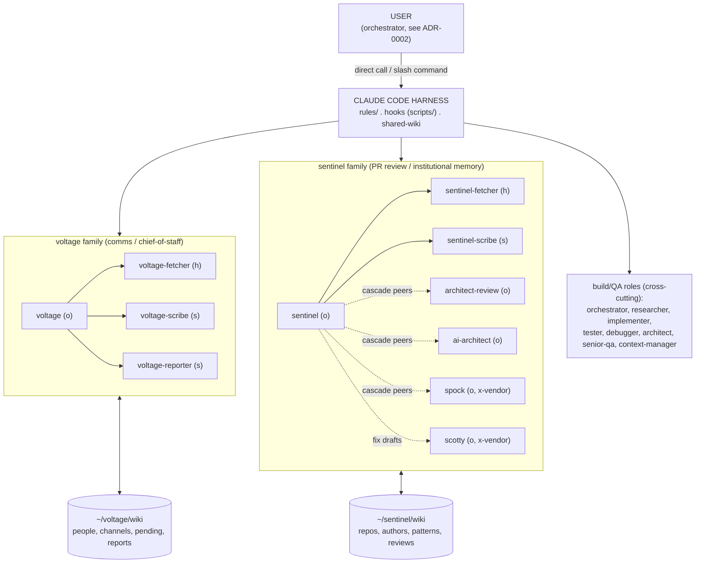
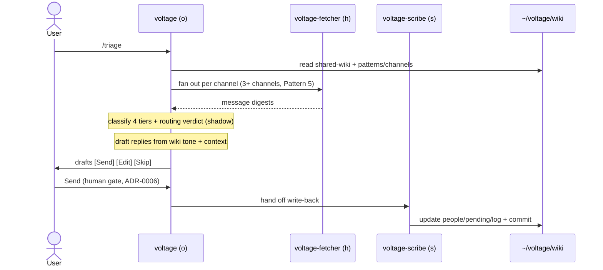
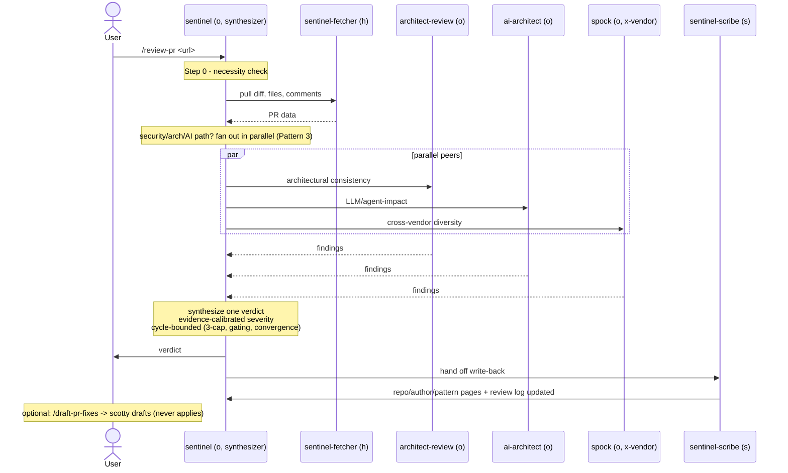

# Architecture

How the stack is put together and how a request moves through it. For *why* each choice was made, see [DESIGN-PRINCIPLES.md](DESIGN-PRINCIPLES.md) and [decisions/](decisions/).

## The one-paragraph version

This is a personal multi-agent stack layered on top of Claude Code. Work is done by **personas** (agent definitions in `agents/`), triggered either directly or through **slash commands** (`skills/`, `commands/`). Personas read from and write back to **wikis** — persistent, git-backed markdown memory that survives across sessions. **Hooks** (`scripts/`) enforce the rules that must never be skipped, at the tool-call layer rather than in a prompt. **Rules** (`rules/`) and a small **shared-wiki** carry the cross-cutting facts and conventions every persona obeys. The user is the orchestrator; personas produce a single perspective and hand back.

## Component map

Model tiers: (o) opus, (s) sonnet, (h) haiku.



## The five layers

### 1. Personas — `agents/`

Each `agents/*.md` is a system prompt with frontmatter (name, description, model, tools). A persona is one perspective on one kind of work. Two families plus a set of build/QA roles:

- **voltage** — chief-of-staff. Triages email/Slack/LINE/Messenger/calendar into four tiers, drafts replies from wiki relationship context, enforces post-send follow-through. Subagents: `voltage-fetcher` (per-channel pull, haiku), `voltage-scribe` (wiki writes, sonnet), `voltage-reporter` (daily/weekly reports, sonnet).
- **sentinel** — PR-review synthesizer with a DevSecOps lens. Reviews diffs, calibrates severity against evidence, tracks repo/author patterns. Subagents: `sentinel-fetcher` (haiku), `sentinel-scribe` (sonnet), and the cascade peers `architect-review`, `ai-architect`, `spock` (cross-vendor), plus `scotty` (cross-vendor patch drafter).
- **build/QA roles** — `orchestrator`, `researcher`, `implementer`, `tester`, `debugger`, `architect`, `senior-qa`, `context-manager`. General software work, not tied to a family.

Model tiering is deliberate — judgment on opus, mechanics on haiku/sonnet. See [ADR-0001](decisions/0001-model-tiering.md).

### 2. Triggers — `skills/` and `commands/`

- `skills/*/SKILL.md` — slash-command workflows: `/triage`, `/review-pr`, `/draft-pr-fixes`, `/daily-report`, `/standup`, `/self-review`, `/pr-sizer`, `/workflow-miner`, and more. A skill is a saved, versioned prompt that wraps a persona with the right setup so the user doesn't re-explain it every time.
- `commands/` — older-style command prompts kept for continuity.

A slash command is the orchestration layer. It does not add a routing persona; it *is* the route. See [ADR-0002](decisions/0002-user-is-orchestrator.md).

### 3. Memory — `wikis/`, `shared-wiki/`

Persistent, git-backed markdown. Every session reads relevant pages before acting and writes back after.

- **Agent wikis** (`~/voltage/`, `~/sentinel/`) — domain memory. People, channels, pending items, reports (voltage); repos, authors, patterns, review log (sentinel). This repo ships only the *machinery* (`wikis/voltage/`, `wikis/sentinel/`: purpose, schema, templates, helper scripts). The *data* fills itself through use and is deliberately excluded.
- **shared-wiki** (`~/.claude/shared-wiki/`) — the small cross-cutting fact layer read by every agent on every invocation: `agent-principles.md`, `search-discipline.md`, `orchestration-patterns.md`, plus entity pages (user, people, repos, projects). Kept to ~3-9 pages by an explicit promotion gate.

Wiki-as-memory is the spine of the whole design. See [ADR-0003](decisions/0003-wiki-as-memory.md).

### 4. Enforcement — `scripts/` (hooks)

PreToolUse / PostToolUse hooks wired into `~/.claude/settings.json` (template in `docs/settings.hooks.example.json`). They fire on Claude tool calls at the harness level, so the LLM cannot forget or route around them:

- `enforce-branch-prefix.sh` — blocks agent-created branches that aren't `<alias>/`.
- `gh-pr-create-gate.sh` — blocks `gh pr create` without `--draft` (review-first workflow).
- `protect-gate-pages.sh` — blocks edits to the review-rubric / shared-wiki pages unless a fresh human unlock marker exists (verifier-immutability).
- `scan-skill.sh` — skill scanner.

Hooks over prompts is a first-class principle — an LLM ignores an instruction ~20% of the time; a hook is deterministic. See [ADR-0004](decisions/0004-hooks-over-prompts.md).

### 5. Conventions — `rules/`

Global rules files (general, git, planning, prompting, python, typescript, testing) injected as instructions. They govern coding style, commit discipline, planning cadence, and prompt authoring across every persona.

## Control flow — two worked examples

### Triage (`/triage` → voltage)

```
user → /triage → voltage (opus)
  1. read shared-wiki (identity, people, projects) + voltage wiki (patterns, channels)
  2. fetch: 3+ channels → fan out to voltage-fetcher (haiku, one per channel, Pattern 5)
           single channel → inline tool call, no subagent
  3. classify each message → 4 tiers (skip/info_only/meeting_info/action_required)
     + routing verdict (auto_digest/team_feed/surface) in shadow mode
  4. draft replies for action_required using wiki tone + relationship context
  5. present drafts with [Send] [Edit] [Skip] — sending is a human gate (ADR-0006)
  6. after send → voltage-scribe (sonnet): update people/pending/log, commit
```



Fetch fans out (research isolation), the model does the judgment (classify + draft), the scribe does the mechanical write-back. Cheap models on the ends, opus in the middle.

### PR review (`/review-pr` → sentinel cascade)

```
user → /review-pr <url> → sentinel (opus, synthesizer)
  1. Step 0 — necessity check: should this PR exist in this shape at all?
  2. sentinel-fetcher (haiku) pulls diff, changed files, existing comments
  3. on security/architectural/AI-impact paths, fan out IN PARALLEL (Pattern 3):
       ├ architect-review (opus)   — architectural consistency
       ├ ai-architect (opus)       — LLM/agent-impact concerns
       └ spock (opus, codex-backed) — cross-vendor reasoning diversity
  4. sentinel SYNTHESIZES all peer outputs into one verdict
     — evidence-calibrated severity (unverified BLOCKERs get downgraded)
     — cycle-bounded: 3-cycle cap, severity gating after cycle 1, convergence detection
  5. sentinel-scribe (sonnet) updates repo/author/pattern pages + review log
  6. optional follow-up: user runs /draft-pr-fixes → scotty drafts patches (never applies)
```



The cascade is the one place fan-out happens, and it is strictly bounded — parallel peers, one synthesizer, a cycle cap. This is Pattern 3, not persona-calls-persona. See [ADR-0005](decisions/0005-cross-vendor-cascade.md) and the [orchestration-patterns catalog](../shared-wiki/orchestration-patterns.md).

## Why families, not one mega-agent

voltage and sentinel share the same skeleton — opus lead, haiku fetcher, sonnet scribe, git-backed wiki — but stay separate because they answer different questions and their memory would drift if merged. A person's triage history and a repo's review history are different surfaces with different decay rates. Shared-wiki carries only the facts *both* need; everything else stays domain-local. This is the promotion/demotion discipline described in `shared-wiki/purpose.md`.

## The orchestration constraint

Claude Code enforces two rules the whole design leans on: subagents cannot spawn subagents, and there are no nested teams. This makes the dangerous orchestration anti-patterns (router personas, deep persona trees, persona-calls-persona chains) *impossible to build by construction* — they just fail to load. Orchestration depth stays at most 1: slash command → personas → synthesis in one designated agent. The full catalog of endorsed patterns and anti-patterns lives in [orchestration-patterns.md](../shared-wiki/orchestration-patterns.md).
